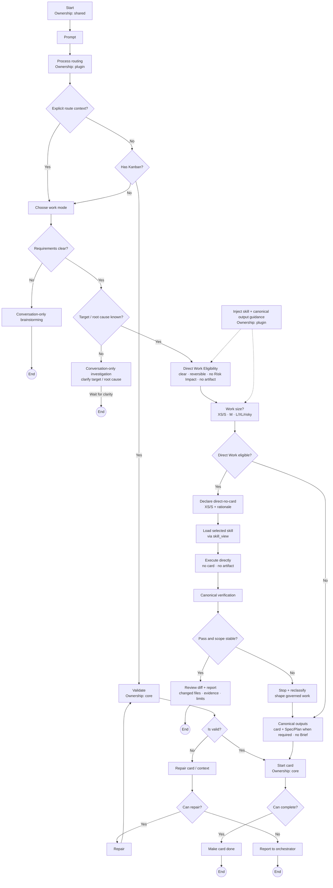

# Gin-harness system — Ginflow skill, ginflow-gate routing and gate

> Derived from [`gin-harness-system.drawio`](./gin-harness-system.drawio), page **Gin-harness system**.
> Draw.io remains canonical. Update Draw.io first, then update this derived Mermaid explanation; it is not mechanically generated.

## Problem

A raw prompt does not reliably establish the right scope, workspace, work size, root cause, verification, or completion boundary. Executing too early can turn an unclear request into the wrong change, treat a risky change as small, or make a completion claim without evidence.

Ginflow supplies the routing and validation vocabulary around the Hermes runtime so governance is proportional to the work. It makes unknown facts a reason to clarify, known larger or risky work a reason to govern, and only affirmatively eligible small work a candidate for Direct Work.

## Hermes-heavy foundation

Gin-harness composes Hermes primitives rather than replacing them:

- Hermes owns profile and runtime routing, Kanban state and tools, skill loading through `skill_view`, and lifecycle execution.
- Ginflow core owns the structured validation and routing model represented by the governed flow.
- The `ginflow-gate` plugin injects bounded routing and canonical-output guidance, and enforces the completion gate at its integration points.
- The target project owns product code, project-local rules, tests, and canonical verification.
- The user supplies intent and resolves unanswered questions; the system does not invent missing requirements or causes.

The plugin provides context and gates; Hermes remains the runtime that evaluates the route, invokes tools, and loads the selected skill. Kanban remains the durable authority for Governed Work.

## Routing mental model

The flow is:

`Prompt → Process routing → route context / Kanban validation → work mode → requirements and root cause → work size and risk → route`

Existing Kanban work enters Ginflow core validation. Invalid card or context data goes through repair and validation again; unrecoverable state is reported to the orchestrator. Without a Kanban card, the runtime chooses a work mode and checks clarity before deciding whether the request can proceed directly, needs governance, or needs clarification.

The decisions are intentionally separate:

- Work Mode describes the kind of activity, such as implementation, verification, recovery, or Clarification.
- Work Size describes complexity and coordination: affected components and owners, behavior or contract impact, ordering, operations, verification layers, and whether the work should split. Raw file count is not a size classifier by itself.
- Risk Impact means a credible effect on security, privacy, data, migration, concurrency, deployment, compatibility, or rollback. A risky keyword without a behavior or control impact is not Risk Impact.

## The three routes

### Direct Work

Direct Work is the route for affirmatively eligible XS/S implementation without a Kanban Card or Governance Artifact. Eligibility requires clear target behavior, a known defect root cause when repairing, localized and reversible scope, no Risk Impact, no Governance Artifact need, known canonical verification, project-local permission, and an unowned single-worker workspace.

The route declares `direct-no-card` with its rationale, loads the selected skill through Hermes `skill_view`, executes without a Kanban card or Governance Artifact, runs canonical verification, and reports the scoped diff, changed files, evidence, and limits. A failed verification, unstable scope, or newly discovered disqualifier stops Direct Work and reclassifies the request as Governed Work.

### Governed Work

Governed Work starts with a build-ready Kanban card. The card owns the objective, scope, acceptance, workspace, assignee, status, links, and progress. Ginflow validates the card before the core starts it; invalid state is repaired or reported rather than silently bypassed.

Known M, L/XL, or risky work produces the canonical governed outputs: the card plus a Spec or Plan when required. A Spec is conditional on behavior or contract drift. A Plan is conditional on ordering, investigation, rollback, coordination, or layered verification. There is no Brief output in this model. Larger work may be split when the resulting cards are independently verifiable, then returns to validation and the card lifecycle.

Completion remains gated: a repairable completion problem returns to repair and validation; an unrepairable problem is reported to the orchestrator; only a valid completion makes the card done.

### Clarification

Clarification is conversation-led and read-only. Unclear requirements enter conversation-only brainstorming. A known requirement with an unknown target or root cause enters conversation-only investigation. Neither path mutates the repository, creates a Kanban card, or creates a Governance Artifact. Once the missing facts are established, the request can return to routing for a fresh decision.

## Ownership and outputs

| Concern | Authority |
| --- | --- |
| Runtime, profiles, Kanban, tools, and skill loading | Hermes |
| Routing model, validation, and card lifecycle semantics | Ginflow core |
| Injected routing guidance and completion enforcement | `ginflow-gate` plugin |
| Product change and canonical project verification | Target project |
| Intent, answers, and clarification decisions | User |

The output contract follows the route. Direct Work produces a Delivery Change, canonical verification evidence, a scoped diff review, and a conversation result. Governed Work produces a Kanban card and only the conditional Governance Artifacts it needs. Clarification produces facts and a rerouting point, not implementation state.

## Derived flow

The following Mermaid diagram covers only the **Gin-harness system** page above. It preserves the page's decisions, branches, ownership labels, and stop boundaries; it is a GitHub-readable derived view, not a second authority.

## Further reading

- Editable source: [`gin-harness-system.drawio`](./gin-harness-system.drawio)
- Subsystem overview: [`gin-harness-system.drawio`](./gin-harness-system.drawio), page **Harness system overview**
- Ginflow skill: [`../../skills/ginflow/SKILL.md`](../../skills/ginflow/SKILL.md)
- Work-size and output contract: [`../specs/GINFLOW-WORK-SIZE-OUTPUT-DOCS.md`](../specs/GINFLOW-WORK-SIZE-OUTPUT-DOCS.md)
- Routing gate: [`../../plugins/ginflow-gate/`](../../plugins/ginflow-gate/)
- Repository mental model: [`../../README.md`](../../README.md)
