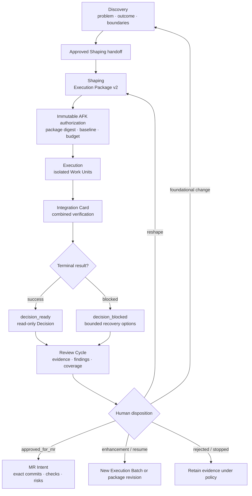

# Gin-harness system — four-phase Ginflow lifecycle

> Derived from [`gin-harness-system.drawio`](./gin-harness-system.drawio), page **Gin-harness system**.
> Draw.io remains canonical. Update Draw.io first, then update this derived explanation; it is not mechanically generated.

## Problem

Large autonomous execution can leave humans without reliable context. Ginflow separates Discovery, Shaping, Execution, and Decision so intent, immutable execution evidence, review findings, and final human authorization remain reconstructable.

## Hermes-heavy foundation

Gin-harness composes Hermes primitives rather than replacing them:

- Hermes owns profile/runtime identity, Kanban state and tools, assignment, dispatch, persistence, and lifecycle authority.
- Ginflow core validates versioned pure records and derives readiness, projections, and provider-neutral intent.
- `ginflow-gate` remains the completion/evidence adapter at native Hermes transitions.
- Target projects own product behavior and canonical verification.
- Adapters collect Git/check evidence, deliver gateway notifications, and later publish provider-specific merge requests.

## Four-phase Initiative lifecycle

One stable Initiative links all records. Phase metadata remains separate from Hermes physical Kanban status.

1. **Discovery** captures problem, desired outcome, constraints, non-goals, prototype evidence, vocabulary, open questions, and approved Shaping handoff. Prototype code is non-production unless explicitly promoted through Spec, Plan, Ticket, acceptance, and verification.
2. **Shaping** retains artifact-first Execution Package v2. Each Ticket declares objective, scope, exclusions, acceptance, dependencies, workspace, owner, verification, Change Group, risk, and escalation. Approval binds package revision and artifact baseline.
3. **Execution** authorizes one immutable `execution_batch/v1` attempt per run. Authorization binds canonical package digest, baseline commit, Ticket set, isolated workspaces, budget, stop conditions, and actor claim. Existing blocked Work Unit and Integration card creation remains the dispatch seam. Integration success opens Decision; it does not complete Initiative.
4. **Decision** starts read-only. `review_cycle/v1` stores exact commits, evidence, findings, deviations, Change Groups, coverage, risks, actor, immutable revisions, and dispositions. Human outcomes are `approved_for_mr`, `enhancement_requested`, `rejected`, `resume_execution`, `reshape_required`, or `stopped`. Only `approved_for_mr` completes Ginflow lifecycle.

Contracts: `initiative/v1`, `execution_batch/v1`, `review_cycle/v1`, `decision_projection/v1`, `notification/v1`, and `merge_request_intent/v1`. Legacy v2 packages and cards without explicit Initiative linkage retain current behavior; linkage is never inferred from titles or branches.

## Decision evidence and boundaries

Decision readiness requires immutable result state, terminal Ticket outcomes, exact baseline/result/target provenance, result-bound canonical verification, deterministic changed-path assignment to Change Groups, and evidence-backed claims. Projection order is decision required, executive context, behavior delta, Change Groups, Ticket/acceptance coverage, verification, risks/findings, choices, exact commits, and MR intent. Projections are bounded and redacted: raw logs, secrets, personal data, internal prompts, and unrestricted transcripts never enter them.

`notification/v1` carries material `decision_ready` or `decision_blocked` events with idempotency, replay, acknowledgement, and bounded delivery state. Transport and subscription setup remain adapter-owned. TUI, direct Hermes database access, and provider-specific publication/merge remain deferred. Rejected/stopped branches and evidence are not automatically deleted.

## Authority and route boundary

| Concern | Authority |
| --- | --- |
| Identity, Kanban, cards, assignment, dispatch, persistence, lifecycle | Hermes |
| Pure contract validation, readiness, projection, notification envelope | Ginflow core |
| Native completion evidence enforcement | `ginflow-gate` |
| Git/check/scanner collection and gateway/provider adapters | Adapters |
| Product behavior and canonical verification | Target project |
| Intent and human disposition | Human operator |

New governed/autonomous work uses the four-phase Initiative lifecycle above. Legacy v1 cards may retain Direct Work and Clarification until closure; those routes are compatibility-only and never bypass a new Initiative record.

## Derived flow

```mermaid
flowchart TD
    discovery["Discovery<br/>problem · outcome · boundaries"] --> handoff["Approved Shaping handoff"]
    handoff --> shaping["Shaping<br/>Execution Package v2"]
    shaping --> auth["Immutable AFK authorization<br/>package digest · baseline · budget"]
    auth --> units["Execution<br/>isolated Work Units"]
    units --> integration["Integration Card<br/>combined verification"]
    integration --> ready{"Terminal result?"}
    ready -- "success" --> decisionReady["decision_ready<br/>read-only Decision"]
    ready -- "blocked" --> decisionBlocked["decision_blocked<br/>bounded recovery options"]
    decisionReady --> review["Review Cycle<br/>evidence · findings · coverage"]
    decisionBlocked --> review
    review --> disposition{"Human disposition"}
    disposition -- "approved_for_mr" --> intent["MR Intent<br/>exact commits · checks · risks"]
    disposition -- "enhancement / resume" --> followup["New Execution Batch or package revision"]
    disposition -- "reshape" --> shaping
    disposition -- "foundational change" --> discovery
    disposition -- "rejected / stopped" --> archive["Retain evidence under policy"]
```

## Further reading

- Editable source: [`gin-harness-system.drawio`](./gin-harness-system.drawio)
- Glossary: [`../../GLOSSARY.md`](../../GLOSSARY.md)
- Ginflow skill: [`../../skills/ginflow/SKILL.md`](../../skills/ginflow/SKILL.md)
- Routing gate: [`../../plugins/ginflow-gate/`](../../plugins/ginflow-gate/)
- Repository mental model: [`../../README.md`](../../README.md)
